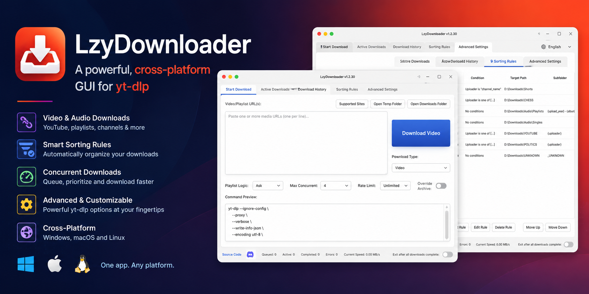
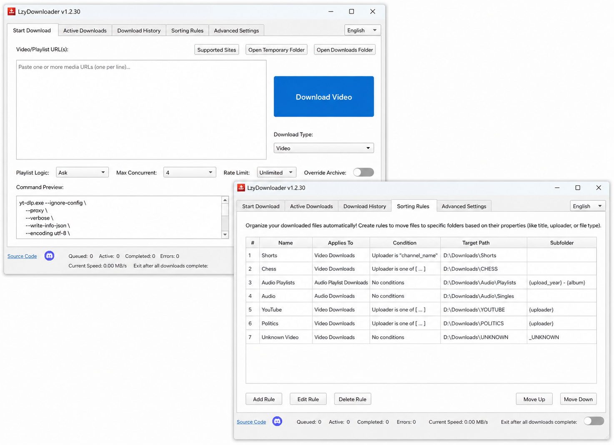

# LzyDownloader — Free Video Downloader and yt-dlp GUI

[](https://github.com/vincentwetzel/lzy-downloader/actions/workflows/release.yml)
[](https://github.com/vincentwetzel/lzy-downloader/releases/latest)

LzyDownloader is a free desktop **video downloader, audio downloader, playlist
downloader, and gallery downloader** powered by [yt-dlp](https://github.com/yt-dlp/yt-dlp),
[gallery-dl](https://github.com/mikf/gallery-dl), and FFmpeg. It provides a native
Qt 6 GUI for downloading supported online media URLs, extracting audio, saving
playlists, embedding metadata and thumbnails, and managing concurrent downloads.

The primary target is Windows, with native Linux and macOS release packaging
also available. LzyDownloader is built in C++20 and is designed as a practical
yt-dlp GUI for people who want queue management, resumable downloads, quality
controls, and clear progress diagnostics without working at a command prompt.

**[Download the latest LzyDownloader release](https://github.com/vincentwetzel/lzy-downloader/releases/latest)** ·
[View the source code](https://github.com/vincentwetzel/lzy-downloader) ·
[Report a bug](https://github.com/vincentwetzel/lzy-downloader/issues/new/choose)

The current C++ release line is 1.2.x. See [CHANGELOG.md](CHANGELOG.md) for
unreleased changes and [UPDATE_AND_RELEASE.md](UPDATE_AND_RELEASE.md) for the
maintainer release workflow.

## What is LzyDownloader?

LzyDownloader is a native desktop alternative to command-line yt-dlp workflows.
Paste a supported media URL, choose video or audio options, and let the queue
handle extraction, downloading, FFmpeg post-processing, verification, and final
file organization. Because site support comes from yt-dlp and gallery-dl, the
application can work with the broad range of extractors maintained by those
projects instead of hardcoding behavior for individual websites.

Common uses include:

- Downloading online videos for offline viewing
- Extracting audio as MP3, M4A, Opus, or another configured format
- Downloading a complete playlist or a selected range of playlist items
- Saving supported image galleries through gallery-dl
- Organizing downloaded media into folders and embedding titles, artists, and artwork
- Running downloads through the optional localhost API or Discord bridge

For remote Discord control, see the companion [LzyDownloader Discord
Bridge](https://github.com/vincentwetzel/lzy-downloader-discord-bot), a Python
bot that connects to the desktop app's authenticated local API.



*LzyDownloader is a cross-platform video and audio downloader GUI for yt-dlp.*



*LzyDownloader's native Qt interface for starting downloads, configuring
playlist behavior, and organizing downloaded media.*

## Features

Thumbnail sidecars left by yt-dlp are remuxed as attached artwork by the
existing FFmpeg post-processing path before temporary cleanup. If no usable
sidecar remains, the normal metadata rewrite continues without an artwork
input.

The downloader keeps actionable diagnostics through transfer and
post-processing. A printed yt-dlp final path is not treated as proof of valid
media: missing fragments, empty data blocks, invalid headers, and invalid
input are reported as incomplete-transfer failures before metadata embedding.

- 🎬 **Download Video & Audio** — Support for YouTube, TikTok, Instagram, and 1000+ other sites via yt-dlp
- 🎵 **Audio Extraction** — Extract audio as MP3, M4A, opus, or other formats
- 📋 **Playlist Support** - Download entire playlists, only the first item, or a selected range of expanded playlist entries
- 🔢 **Playlist Filename Prefixes** - Audio playlist files use zero-padded index prefixes by default (for example, `01 - Title.opus`), with an explicit opt-out in Download Options
- 🖼️ **Gallery Support** — Download image galleries from supported sites (e.g., Instagram, Twitter) via `gallery-dl`
- 🎨 **Advanced Settings** — Quality selection, format filtering, SponsorBlock integration, metadata embedding
- 🎛️ **Runtime Format Selection** — Optionally prompt for specific video/audio qualities on every download, supporting multiple simultaneous format selections for the same media
- 🔄 **App Updates** — Checks validated GitHub Releases for newer installers, saves unfinished downloads, stops downloader processes, and automatically restarts the app after installation
- 🔌 **Local API** — Optional localhost API for trusted local integrations such as Discord bots
- 📊 **Concurrent Downloads** — Queue and manage multiple downloads simultaneously
- 🌙 **Sleep Prevention** — Prevents system idle sleep while downloads, post-processing, or finalization are active in GUI and non-interactive server/headless/background modes; the display may still turn off normally
- 📌 **Compact Footer Status** — Download counters and current speed share the footer's first row, with the exit-after-downloads switch at the far right
- ⏸️ **Pause & Resume** — Safely stop downloads, preserve partial `.part` files, and resume validated queue backups across application restarts
- 🧰 **External Binaries Manager** — Detect, version-check, install, and update `yt-dlp`, `gallery-dl`, `ffmpeg`, `ffprobe`, `aria2c`, and `deno` from inside the app, with version-aware local `bin` discovery, package-manager-aware commands, wrapped command previews, exact installed/latest update warnings, persistent prompts for manually managed tools, SHA-256 checks when available, and cancellable install/update logs. Fresh interactive installs use guided system-first/app-managed-first setup with optional-tool provisioning; a WinGet-managed Deno install can fall back to the official stable installer when the catalog lags upstream.
- 🛡️ **Recovery Diagnostics** — Distinguishes incomplete media and critical extractor failures from recoverable post-processing warnings, even when yt-dlp printed a final path
- 🎚️ **Media-Aware Quality Warnings** — Video-resolution warnings apply only to video downloads; audio extraction remains audio-labeled even when yt-dlp transfers a combined video/audio source
- 🔗 **Useful Quality Warnings** — Low-quality video warnings include the media title and a clickable source link when the URL is complete
- 🖼️ **Thumbnail Embedding** — Automatic thumbnail download, bounded preview loading, and embedding for videos and audio
- 🌐 **Browser Cookies** — Use saved cookies from Firefox, Chrome, Edge, or other browsers for age-restricted content; explicit browser-cookie extraction failures may retry once without cookies
- 📂 **Smart Sorting** — Automatically organize downloads into subfolders based on uploader, playlist, date, or custom patterns
- 🛡️ **Duplicate-safe retries** — Equivalent source URLs share a normalized media identity, preventing duplicate queue/retry jobs without adding site-specific downloader behavior
- 🔁 **Terminal retry recovery** — Explicit API re-downloads can replace matching restored stopped/failed jobs, while genuinely paused downloads remain protected
- 📈 **Transfer progress recovery** — Native downloads recover stream sizes from yt-dlp format metadata and bounded `.part`-file polling keeps progress moving when yt-dlp temporarily emits no progress line
- 📊 **Single-bar progress display** — Active download rows keep progress focused on the current transfer or processing stage without a secondary aggregate bar
- 🤖 **Stable Discord progress** — The bridge uses backend aggregate progress for multi-stream jobs so Discord percentages do not reset during video/audio handoff
- 🧱 **Safe destination replacement** — Intentional re-downloads preserve the existing completed file until the verified replacement is in place; failed replacements leave the old file recoverable

## Installation

### Windows (Recommended)

Download the latest installer from [Releases](https://github.com/vincentwetzel/lzy-downloader/releases):

1. Download `LzyDownloader-Setup-X.X.X.exe`
2. Run the installer
3. On the final installer page, leave “Launch LzyDownloader” checked to start the app immediately, or launch it later from the Start Menu or desktop shortcut

Release assets include a platform-specific `SHA256SUMS-*.txt` file. Verify the
checksum for the installer or package before running it. On Windows, use
`Get-FileHash .\LzyDownloader-Setup-X.X.X.exe -Algorithm SHA256`; on Linux use
`sha256sum LzyDownloader-X.X.X-x86_64.AppImage`; and on macOS use
`shasum -a 256 LzyDownloader-X.X.X-macos-*.dmg`. Compare the result with the
matching release manifest.

### From Source

Requires CMake, a C++20 compatible compiler, and Qt 6. The checked-in Windows
presets use the supported Qt MinGW/Ninja toolchain; the build deploys the Qt
platform/runtime and MinGW runtime DLLs needed by the executable and tests.

The repository includes a `vcpkg.json` manifest for source builds with a pinned `builtin-baseline` for reproducible dependency resolution. The manifest enables only the Qt modules used by the application and tests (`concurrent`, `gui`, `network`, `sql-sqlite`, `testlib`, and `widgets`), plus Qt D-Bus on Linux for idle-sleep inhibition. On Windows, the checked-in `CMakePresets.json` expects vcpkg at `E:/vcpkg/scripts/buildsystems/vcpkg.cmake`, Qt's MinGW toolchain under `C:/Qt/Tools/mingw1310_64/bin`, and Ninja under `C:/Qt/Tools/Ninja`. If these paths differ on your machine, adjust the preset or pass equivalent compiler, generator, and toolchain settings when configuring.

```bash
# Clone the repo
git clone https://github.com/vincentwetzel/LzyDownloader.git
cd LzyDownloader

# Configure and build with the checked-in preset
cmake --preset release
cmake --build build --config Release
```

Example manual configure command:

```bash
cmake -B build -DCMAKE_BUILD_TYPE=Release -DCMAKE_TOOLCHAIN_FILE=E:/vcpkg/scripts/buildsystems/vcpkg.cmake
cmake --build build --config Release
```

For local Windows debugging, use the checked-in `debug` preset. It writes to
`build-debug` and uses the same MinGW/Ninja toolchain as the release preset;
the local Qt installation supplies the host Qt tools while vcpkg supplies the
target libraries.

The VS Code task `CMake: Configure Debug` runs
`tools/configure_debug.ps1`, which checks for incomplete compiler metadata and
automatically selects a fresh configure when recovery is needed.

```bash
cmake --preset debug
cmake --build --preset debug
```

If CMake reports a manifest-mode mismatch or `No known features for CXX
compiler`, the generated `build-debug` directory contains stale or incomplete
compiler metadata. Run `cmake --fresh --preset debug` once (or use the VS Code
task **CMake: Fresh Configure Debug**), then run the normal build command again.

Windows builds copy Qt runtime plugins and runtime DLLs through a guarded
post-build CMake helper. This keeps deployment safe when multiple build
processes target the same runtime directory. MinGW builds also expose the
compiler's sibling `bin` directory to compiler subprocesses, and Qt's optional
compiler-predefines probe is disabled
because it is not needed by this project and can fail when MinGW is launched
through libuv-based tooling.

### Testing

Qt test sources and fixtures live in the top-level `tests/` directory. Test executables are registered through CMake and can be run with CTest. The current suite includes argument builders, playlist parsing and fallback, download-manager behavior, worker progress/recovery, persistence, API, sorting, UI, URL, and end-to-end coverage. For headless Windows/CI runs, the helper builds before testing (and stops before test execution on a build failure), timestamps streamed output, runs CTest in parallel, prints a final summary, and stores failed tests in the build tree. On Visual Studio builds it forwards the vcpkg setting from the CMake cache: manifest configurations enable manifest mode, while direct-Qt configurations disable the vcpkg MSBuild integration so it does not emit the misleading manifest-disabled diagnostic:

```bash
python tests/run_headless_tests.py --build-dir build --config Release
```

Use `python tests/run_headless_tests.py --build-dir build --config Release --suspects` to rerun only tests recorded as failing by the previous run. The default cache is `build/.lzy-test-suspects.json`.

Current coverage includes argument construction (including aria2c retry policy), progress parsing, browser-cookie recovery, queue-backup status/field persistence and malformed-entry filtering, protected temporary-directory root fallback and ownership cleanup, negative aria2c recovery boundaries, archive normalization, configuration defaults/reset cleanup, Local API auth/enqueue behavior, process binary-resolution caching and explicit/WinGet discovery, URL validation, sorting sanitization, playlist range selection, the single-bar download widget and compact External Binaries scroll layout, and a local end-to-end download fixture.

### Release Checklist

Before building a release, keep all release metadata in sync:

- `CMakeLists.txt` `project(VERSION x.y.z)` is the app version source of truth.
- The release builder compares that version with fetched `vX.Y.Z` tags and stops when it is not newer; tag-triggered CI also requires an exact tag/version match. Set `LZY_ALLOW_VERSION_REBUILD=1` only for an intentional rebuild of an existing release.
- `vcpkg.json` `version-string` must be updated to the same version, and `builtin-baseline` should remain pinned to the intended vcpkg commit.
- GitHub Actions is the normal release packaging path: push a synchronized
  release commit, then its matching `vX.Y.Z` tag. The workflow runs
  `build_release.py` on the Windows, Linux, Intel macOS, and Apple Silicon
  runners. Local `build_release.py` runs are optional diagnostics only.
- The release builder remains native-only: GitHub Actions selects the platform
  runner and packaging path for each artifact. Its `--target` options are for
  explicitly requested local diagnostics, not the normal release procedure.
- Windows GitHub Actions installs NSIS before packaging; local NSIS setup is
  only relevant to explicitly requested packaging diagnostics.
- Windows and Linux GitHub Actions install the pinned prebuilt Qt 6.10.2 SDK
  (`win64_msvc2022_64` and `gcc_64`) instead of compiling Qt through vcpkg;
  macOS uses the matching `clang_64` SDK.
- macOS CI builds separate Intel (`macos-15-intel`) and Apple Silicon (`macos-15`) app bundles from Qt's universal `clang_64` archive, deploys Qt with `macdeployqt`, and packages `LzyDownloader-X.Y.Z-macos-x86_64.dmg` plus `LzyDownloader-X.Y.Z-macos-arm64.dmg`.
- Release automation installs yt-dlp from its prerelease/nightly channel (`pip install --pre --upgrade yt-dlp`) so extractor/runtime changes are exercised before packaging.
- Linux AppImage packaging uses qmake from the same prebuilt Qt SDK that built
  the executable when invoking linuxdeploy, including QtSql's SQLite plugin
  discovery.
- If a tag-matched `release-notes/<tag>.md` file is absent, CI creates a minimal fallback release body so GitHub Release publication does not emit a missing-file warning.
- The workflow also supports `workflow_dispatch` validation runs; release assets are uploaded only when the workflow was started by a `v*` tag.
- Each tag release includes a platform-specific `SHA256SUMS-*.txt` manifest beside the packaged installer, AppImage, or DMG.
- Local Linux source builds that choose vcpkg still need the development
  packages required by that vcpkg revision; they are not release-runtime
  dependencies.
- `LzyDownloader.nsi` must not contain stale hardcoded version examples or installer metadata; pass the release version with `makensis /DAPP_VERSION=x.y.z /DRELEASE_BUILD_DIR=build-release\Release LzyDownloader.nsi` when building manually.
- `CHANGELOG.md` must move `[Unreleased]` notes under the dated release version.
- The normal release workflow is metadata preparation followed by pushing the
  release commit and matching `v*` tag. Pushing the tag starts
  `.github/workflows/release.yml`, which builds the Windows installer, Linux
  AppImage, and Intel/Apple-Silicon macOS DMGs and attaches them to the GitHub
  Release; local packaging is optional diagnostics only.

## Usage

1. **Launch the app** (`LzyDownloader.exe`)
2. **Enter a URL** in the "Start Download" tab
3. **Configure options** (quality, format, playlist behavior, SponsorBlock, etc.)
4. **Click Download** to start
5. **Monitor progress** in the "Active Downloads" tab
6. **Find completed files** in your configured output folder

When playlist handling is set to `Ask`, detected playlists can be queued entirely, reduced to the first item, cancelled, or narrowed with **Download Part...**. The partial playlist dialog accepts ranges such as `1-5, 8, 11-13` and keeps the range text synchronized with individual item checkboxes.

## Configuration

All settings are saved to `%LOCALAPPDATA%\LzyDownloader\settings.ini` on Windows and persist between sessions. GUI and `--server`/`--headless`/`--background` launches share this same preferences file, so folders, binary paths, templates, cookies, codecs, and related choices stay in sync. The app uses a Qt-native `QSettings` INI layout. Download history is shared through `download_archive.db`.

- **Output folder** — Where completed downloads are saved
- **Temporary folder** — Where downloads are cached during progress
- **Quality/Format** — Video/audio codec and quality preferences
- **Output templates** — Type-specific video/audio templates inherit the shared default when blank and are validated with `yt-dlp` before saving
- **Metadata** — Embed titles, artists, and thumbnails
- **SponsorBlock** — Automatically skip sponsored segments
- **Browser Cookies** - Select a browser to use for authentication
- **Browser Cookie fallback** - Public media can retry once without browser cookies when yt-dlp's cookie extraction or cookie-backed extractor state fails
- **Livestream replays** - Completed livestreams are detected from yt-dlp `live_status` metadata and downloaded as archived media; active/upcoming streams keep native wait and Finish Now behavior
- **Download History links** - Valid HTTP/HTTPS source URLs are keyboard-accessible links; malformed or incomplete values remain plain text
- **Queue previews** - Queued rows begin loading supplied remote thumbnails immediately, and long titles wrap within narrow windows so row actions remain reachable
- **Playlist audio filenames** - Playlist audio downloads are prefixed with zero-padded indices by default; change `Download Options -> Prefix playlist indices` to disable this behavior
- **Local API** - Enable a localhost-only API server from Advanced Settings -> Configuration
- **Binary management** - Choose app-managed-first or system-first resolution and configure launch, daily, or weekly automatic updates for app-managed tools in Advanced Settings -> External Tools. Options marked **(Recommended)** install a private copy in the platform app-data `bin` folder (on Windows, `%LOCALAPPDATA%\\LzyDownloader\\bin`); package-manager choices remain explicit alternatives and update through their manager. Explicit Browse selections and completed local installs remain selected regardless of preference. Windows FFmpeg updates install and retain both `ffmpeg.exe` and `ffprobe.exe` together. If startup finds an outdated tool that was not updated automatically, **Update Now** runs the same manager-aware update action as External Tools, while **Open External Binaries** exposes alternate methods.

### Local API

When enabled in the GUI, or when launched with `--server`, `--headless`, or `--background`, LzyDownloader listens only on `127.0.0.1:8765`. The API token is stored in the app-local data directory as `api_token.txt`; server/headless/background mode keeps its runtime token under `Server/api_token.txt`. Requests must send the token as a Bearer token.

Equivalent URLs are deduplicated using normalized media identity across queued, active, paused, retried, and archived states. Disk-full diagnostics are terminal failures, and explicit replacement of an existing destination preserves the old file until the new verified output is in place.

- `POST /enqueue` with JSON body `{"url":"https://...","type":"video","id":"optional-stable-job-id","override_archive":true}` queues a download using non-interactive defaults. `type` is optional and may be `video`, `audio`, or `gallery`; omitted requests default to `video`. `id` is optional; when omitted, the app generates a UUID. `override_archive` is optional and may also be supplied under `options`; it must be explicitly true for an intentional re-download.
- `POST /cancel` with JSON body `{"job_id":"..."}` requests cancellation of a tracked queued or active job. The endpoint uses the same bearer token and returns `404` for an unknown job ID.
- `GET /status` returns current tracked jobs, including progress fields when available.
- Requests are bounded and validated; malformed request lines, oversized payloads, invalid Host headers, or untrusted browser origins are rejected.
- **Webhook Outbound**: The application automatically emits real-time HTTP POST JSON payloads to `http://127.0.0.1:8766/webhook` whenever download status, progress, speed, or ETA changes. Payloads are throttled to 1.5 seconds, sanitize long or multi-line status strings, preserve terminal completion/cancellation state for local bridge clients, include `parent_id` mapping to track playlist child items, carry `overall_progress` for multi-stream jobs when available, report non-interactive validation/duplicate/missing-binary/runtime/terminal failures with an `error` diagnostic, and clean up bounded network replies through the owning window context.

Automation can also launch `LzyDownloader.exe --background <url>`, `LzyDownloader.exe --server <url>`, or `LzyDownloader.exe --headless <url>` to enqueue a direct URL without showing blocking prompt dialogs. Server/headless/background queue backups, API tokens, and logs are isolated under `Server/`, but user preferences still come from the main `settings.ini`.

Extractor-list refresh scripts are non-interactive and live under `tools/`, so release automation can run `tools/update_yt-dlp_extractors.py` and `tools/update_gallery-dl_extractors.py` without waiting for a final keypress. They write the generated extractor JSON files to the repository root because those files are bundled runtime assets.

Temporary downloads are isolated in per-download UUID folders under the shared temporary-root resolver: the configured temporary directory, `<completed_downloads_directory>/temp_downloads`, or the operating-system temp directory under `LzyDownloader` when neither setting is available. Terminal finalization removes the guarded UUID folder on terminal output or final-destination failures, while stopped and failed downloads retain their partial data for resume or manual cleanup. After queue restoration, an asynchronous startup sweep removes only unprotected direct-child UUID folders; restored stopped/failed IDs, non-UUID folders, symlinks, and the shared root are preserved. Playlist expansion checks reuse the full yt-dlp command configuration without creating transfer-only UUID folders.

When aria2c is enabled for an ordinary non-livestream download, the app uses bounded retries and a conservative per-server connection limit. A transient aria2c exit code (2, 5, 6, or 29), or an `Unable to download video` file-not-found diagnostic for aria2c's expected temporary media `.part` file, triggers at most one delayed retry through yt-dlp's native downloader. The recovery removes stale `.info.json` sidecars but preserves media `.part` files, and reports the recovery stage and retained diagnostics in the queue row.

## Frequently Asked Questions

### Is LzyDownloader a YouTube downloader?

LzyDownloader is a general-purpose yt-dlp GUI. It accepts URLs supported by
yt-dlp rather than implementing a separate downloader for one website. YouTube
and many other extractors are supported according to the capabilities and
current compatibility of the installed yt-dlp version.

### Can LzyDownloader download audio?

Yes. Audio downloads can extract MP3, M4A, Opus, or another configured format.
The application can embed title, artist, album, and thumbnail metadata after
FFmpeg finishes processing the download.

### Can it download playlists?

Yes. Playlist downloads can include every item, the first item, or a selected
range. Audio playlist filenames can include zero-padded playlist indices so the
result remains ordered in music players and file browsers.

### Is LzyDownloader available for Windows, Linux, and macOS?

Windows is the primary desktop target and has an installer. Native Linux
AppImage and macOS DMG packages are produced by the release workflow when those
platform builds are published. Building from source requires CMake, Qt 6, and
a C++20 compiler.

### Does it require yt-dlp and FFmpeg?

Yes. The application uses external `yt-dlp`, `gallery-dl`, `ffmpeg`, and
`ffprobe` executables. Optional `aria2c` and `deno` integrations are supported.
The External Binaries page can discover, configure, install, and update these
tools without bundling them into the repository.

## Architecture

### Current download behavior

Playlist probing is asynchronous: ordinary URLs recover from transient probe
failures, while explicit playlist-shaped URLs and missing tools fail visibly.
Livestream state comes from extractor metadata or explicit wait options, not
URL/title words. Incomplete media is rejected before metadata embedding, and
accurate cuts re-encode audio with bounded post-processing.

See [docs/FILE_MANIFEST.md](docs/FILE_MANIFEST.md) for paths,
[docs/API_SURFACE.md](docs/API_SURFACE.md) for interfaces,
[docs/SPEC.md](docs/SPEC.md) for requirements, and
[docs/ARCHITECTURE.md](docs/ARCHITECTURE.md) for data flow.

Contributors should start with [`AGENTS.md`](AGENTS.md), which routes each task
to the smallest relevant reference instead of requiring all technical docs.

The application uses **C++20**, **Qt 6**, and the `LzyAppLib` static library.

```
LzyDownloader/
├── CMakeLists.txt              # Build System Configuration
├── main.cpp                    # Application Entry Point
├── tests/                      # Qt tests, fixtures, and test-only helpers
├── src/
│   ├── core/                   # Core Business Logic
│   │   ├── ConfigManager.h/cpp   # Settings persistence (INI)
│   │   ├── ArchiveManager.h/cpp  # Download history (SQLite)
│   │   ├── DownloadQueueState.h/cpp # Manages persistence of download queue state
│   │   ├── DownloadManager.h/cpp # Queue & Lifecycle Management
│   │   ├── LocalApiServer.h/cpp  # localhost API for local integrations
│   │   ├── DownloadFinalizer.h/cpp # File Verification & Moving
│   │   ├── YtDlpWorker.h/cpp     # QProcess Wrapper & Parsing
│   │   └── ...
│   ├── ui/                     # User Interface (Qt Widgets)
│   │   ├── MainWindow.h/cpp      # Main Window & Signal Hub
│   │   ├── MainWindowUiBuilder.h/cpp # Builds UI for MainWindow
│   │   ├── StartTab.h/cpp        # Input Tab (Orchestrates helper classes for URL handling, download actions, and command preview)
│   │   ├── StartTabUiBuilder.h/cpp # Builds UI for StartTab
│   │   ├── start_tab/
│   │   │   ├── StartTabDownloadActions.h/cpp # Handles download actions and format checking
│   │   │   ├── StartTabUrlHandler.h/cpp # Manages URL input and clipboard
│   │   │   └── StartTabCommandPreviewUpdater.h/cpp # Updates command preview
│   │   ├── ActiveDownloadsTab.h/cpp # Progress Tab
│   │   ├── advanced_settings/
│   │   │   ├── MetadataPage.h/cpp    # Metadata & Thumbnail configuration
│   │   │   └── ...
│   │   └── ...
│   └── utils/                  # Helper Modules
│       └── ExtractorJsonParser.h/cpp # Extractor-domain cache loader
```

**Note:** External binaries (yt-dlp, ffmpeg, ffprobe, gallery-dl, aria2c, deno) are not bundled with the application. Users must install them separately or configure paths in Advanced Settings.

## Contributing

Contributions are welcome. See [CONTRIBUTING.md](CONTRIBUTING.md) for build,
testing, documentation, and pull-request guidance.

## License

LzyDownloader is licensed under the [GNU General Public License v3.0 or
later](LICENSE). Third-party components, including Qt, yt-dlp, gallery-dl, and
FFmpeg, remain under their respective licenses.
